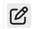

# Hotel Guest List

  <a href="#" class="close">&times;</a>
  

Bu ekranda otele giriş yapan tüm misafirlerin detaylı bilgileri listelenir. Misafirler hakkında check-in/check-out bilgileri, oda detayları, ücretlendirme ve diğer operasyonel bilgiler görüntülenebilir.

## Alan Açıklamaları

- **Id**: Kayıt numarası (sistem tarafından otomatik atanan benzersiz numara)
- **Created At**: Kaydın oluşturulma tarihi ve saati
- **Category**: Misafir kategorisi (Local, VIP vb.)
- **Guest**: Misafir adı ve soyadı
- **Room Mate**: Oda arkadaşı sayısı
- **Status**: Rezervasyon durumu (Pending - Beklemede, Confirmed - Onaylandı vb.)
- **Check In**: Giriş tarihi ve saati
- **Check Out**: Çıkış tarihi ve saati
- **Day Count**: Konaklama gün sayısı
- **Room Type**: Oda tipi (TRP - Triple, DBL - Double, SNG - Single vb.)
- **Room No**: Oda numarası
- **Room Price**: Oda ücreti
- **Board Type**: Pansiyon tipi (BB - Bed & Breakfast vb.)
- **Expense Use**: Harcama kullanımı (Yes/No)
- **Flight**: Uçuş bilgisi durumu
- **Ticket Type**: Bilet tipi
- **From**: Nereden geldiği
- **To**: Nereye gittiği
- **To2**: İkinci varış noktası
- **Pnr**: Pnr bilgisi
- **Pnr2**: İkinci Pnr bilgisi
- **Flight Ticket Price**: Uçak bileti ücreti
- **Is Business**: Business class durumu (Yes/No)
- **Note**: Genel notlar
- **Remark**: Açıklamalar
- **Phone**: Telefon numarası
- **Mini**: Mini bar kullanımı
- **Spa**: Spa kullanımı
- **CreatedByName**: Kaydı oluşturan kullanıcı adı
- **Expenses**: Harcamalar
- **TotalExpense**: Total harcama tutarı

## Actions

-  : Reservasyon bilgilerini güncellemek için kullanılır.
-  : Reservasyon kaydının kopyasını oluşturmak için kullanılır
-  : Reservasyon kaydını silmek için kullanılır.

  <a href="#" class="close">&times;</a>
  

  <a href="#" class="close">&times;</a>
  

  <a href="#" class="close">&times;</a>
  

## Setting Butonu

  <a href="#" class="close">&times;</a>
  

Setting butonu ile otomatik expense oluşturma ayarları yapılır:

### Otomatik Expense Ayarları

**Flight Expense Ayarı**
- Rezervasyon oluşturma işleminde flight alanı dolu ise sistem otomatik olarak flight expense oluşturacaktır
- Bu ayar ile sistemden bu expense'in hangi türde girileceği seçilir

**Hotel Expense Ayarı**
- Rezervasyon oluşturma işleminde room type alanı dolu ise sistem otomatik olarak hotel expense oluşturacaktır
- Bu ayar ile sistemden bu expense'in hangi türde girileceği seçilir

**Flight Return Ticket Expense Ayarı**
- Rezervasyon oluşturduktan sonra uçuş değişikliklerindeki cost işlemi expense olarak eklenecektir
- Bu ayar ile bu expense'in hangi expense türünde girileceği seçilir

## Reservasyon Ekleme (Create Butonu)

  <a href="#" class="close">&times;</a>
  

Create butonu ile yeni rezervasyon oluşturma formunda aşağıdaki alanlar bulunur:

### ⚠️ Önemli Not
**Is Walk In** checkbox'ı işaretli ise sistem tarafından otomatik oluşan expense kayıtları oluşmaz, sadece manuel expense kayıtları oluşur.

### Guest Name
- **Search**: Misafir seçimi
- **Visitor Category**: Misafir kategorisi seçimi 
- **Room Mate**: Oda arkadaşı seçimleri(Birden fazla olabilir)

### Reservation Details
- **Check In**: Giriş tarihi seçimi 
- **Check Out**: Çıkış tarihi seçimi 
- **Room Type**: Oda tipi seçimi (TRP, DBL, SNG vb.)
- **Room No**: Oda numarası girişi
- **Board Type**: 
- **Room Price**: Oda tipinden default olarak bir değer gelir ama manuel değişim yapılabilmektedir.
- **Total**: Toplam tutar (otomatik hesaplanır)
- **Note**: Genel notlar için metin alanı
- **Remark**: Açıklamalar için metin alanı

### Flight & Travel Information
- **Flight**: Uçuş bilgisi checkbox'ı
- **Ticket Type**: Bilet tipi seçimi (Casino vb.)
- **From**: Nereden geldiği bilgisi
- **To**: Nereye gittiği bilgisi
- **To2**: İkinci varış noktası
- **Pnr**: PNR kodu girişi
- **Pnr2**: İkinci PNR kodu girişi
- **Flight Ticket Price**: Uçak bileti ücreti
- **Is Business**: Business class checkbox'ı

### Other Options
- **Phone**: Telefon bilgisi checkbox'ı
- **Minibar**: Minibar kullanımı checkbox'ı
- **Spa**: Spa kullanımı checkbox'ı
- **Fb**: Facebook bilgisi checkbox'ı
- **Expense Use**: Harcama kullanımı checkbox'ı
- **Status**: Rezervasyon durumu (Pending vb.)

### Expense Parameters
- **Expense Parameter**: Harcama parametresi seçimi
- **Add Expense**: Yeni harcama ekleme butonu
- **Quantity**: Miktar girişi
- **Unit Price**: Birim fiyat girişi
- **Total**: Toplam tutar (otomatik hesaplanır)

### Form Butonları
- **Cancel**: İptal butonu - Formu kapatır
- **Save**: Kaydet butonu - Rezervasyonu kaydeder

