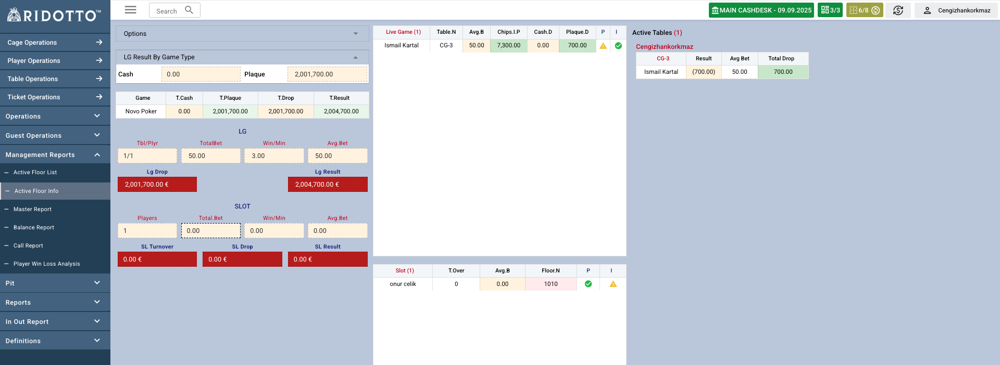
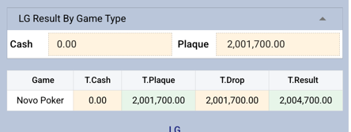
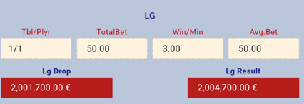
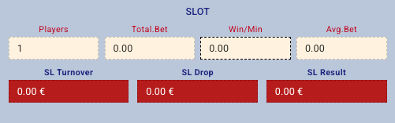
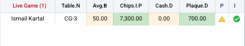
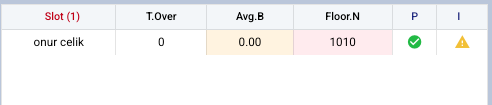
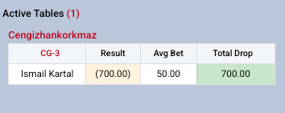

Active Floor Info sayfası, casino floor'unda bulunan tüm slot makineleri ve live game masalarının detaylı bilgilerini ve durumlarını görüntülemek için kullanılır.

## Genel Bakış

Bu rapor, casino yöneticilerinin floor üzerindeki tüm oyun ekipmanlarının durumunu tek bir ekrandan takip etmesini sağlar. Hem slot makineleri hem de live game masaları için kapsamlı bilgi sunar.

### Lg Result By Game

- **Cash** : Live game masalarında oyuncuların cash drop toplamı
- **Plaque** : Live game masalarında oyuncuların plaq drop toplamı

#### Tablo Sütunları
- **Game** : Oyun türü (Blackjack, Roulette, Poker vb.)
- **T.Cash** : Toplam cash drop
- **T.Plaque** : Toplam plaque drop
- **T.Drop** : Toplam Drop(cash drop + plaque drop)
- **TResult** : Oyun result bilgisi (casino açısından) 

### Lg Info

- **Tbl/Player**: Aktif olan lg masa sayısı ve oyuncu sayısı
- **TotalBet**: Aktif masalarda oynanan toplam bahis miktarı(Oyuncuların avg bet toplamı)
- **Win/Min**: Aktif masalarda dakikada casino kazancı (oyuncuların avg bet toplamı / oyun süresi * oyun house edge değeri) 
- **AvgBet**: Aktif masalarda oynanan ortalama bahis miktarı (Toplam bet / oyuncu sayısı)
- **Lg Drop**: Tüm gün yapılan toplam drop miktarı(cash+plaque)
- **Lg Result**: Tüm gün oyun sonucu(casino açısından)

### Slot Info

- **Players**: Slot makinelerinde oturan toplam oyuncu sayısı
- **TotalBet**: Slot makinelerinde oynanan toplam bahis miktarı
- **Win/Min**: Slot makinelerinde dakikada casino kazancı (Toplam bet / oyun süresi)
- **AvgBet**: Slot makinelerinde oynanan ortalama bahis miktarı (Toplam bet / oyuncu sayısı)
- **SL Turnover**: Slot makinelerinde toplam bet miktarı
- **SL Drop**: Slot makinelerinde toplam drop miktarı
- **SL Result**: Slot makinelerinde oyun sonucu

### Live Game Masa Durumu

Live game maslarında aktif olarak oturan oyuncuların bilgisini verir.

- **Table.N**: Masa adı 
- **Avg.B**: Ortalama bahis miktarı
- **Chips.I.P**: Cebindeki toplam çip ve plak miktarı
- **Cash.D**: Cash drop miktarı
- **Plaque.D**: Plaque drop miktarı
- **P**: Portfolyo durumu (Rating değerinin oluşup oluşmadığını gösterir)
- **I**: İletişim bilgilerinin tam olup olmadığı bilgisini verir(Telefon numarası, doğum tarihi)

### Slot Makine Durumu

Slot makinelerinde aktif olarak oturan oyuncuların bilgisini verir.

- **T.Over**: Toplam bet miktarı
- **Avg.B**: Ortalama bahis miktarı
- **Floor.N**: Floor numarası
- **P**: Portfolyo durumu (Rating değerinin oluşup oluşmadığını gösterir)
- **I**: İletişim bilgilerinin tam olup olmadığı bilgisini verir

### Active Tables

Bu bölümde, casino floor'unda aktif olan tüm oyun masalarının detaylı bilgileri görüntülenir.

