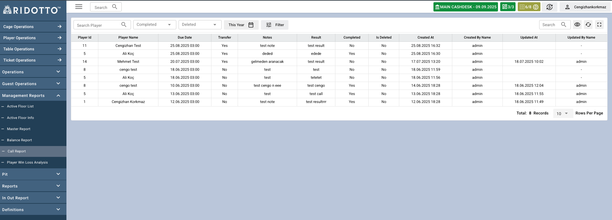

## Genel Bakış

Call Report sayfası, pr'ların  oyuncularla yaptığı  telefon görüşmelerinin kayıtlarını ve takibini yapmak için kullanılır.

### Tablo Sütunları
- **Player Id**: Oyuncu id değeri
- **Player Name**: Oyuncunun adı ve soyadı
- **Due Date**: Görüşme yapılması gereken tarih
- **Transfer**: Transfer durumu (Yes/No)
- **Notes**: Görüşme ile ilgili notlar
- **Result**: Görüşme sonucu
- **Completed**: Görüşmenin tamamlanma durumu (Yes/No)
- **Is Deleted**: Kaydın silinme durumu (Yes/No)
- **Created At**: Kaydın oluşturulma tarihi
- **Created By Name**: Kaydı oluşturan kişinin adı 
