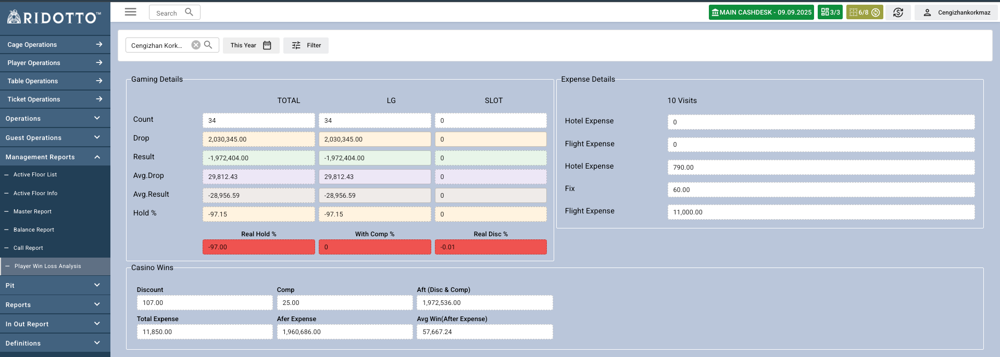

Player Win Loss Analysis sayfası, oyuncuların oyun performanslarını ve casino ile olan finansal durumlarını detaylı olarak analiz etmek için kullanılır.

## Genel Bakış

Bu rapor, seçilen oyuncunun slot ve live game oyunlarındaki performansını, harcamalarını ve casino açısından karlılığını gösterir.

### Gaming Details

#### TOTAL Sütunu
- **Count**: Toplam gün sayısı
- **Drop**: Toplam drop miktarı
- **Result**: Oyun sonucu (casino açısından)
- **Avg Drop**: Ortalama drop miktarı
- **Avg Result**: Ortalama result değeri
- **Hold %**: Hold yüzdesi

#### LG (Live Game) Sütunu
- **Count**: Live game oyun sayısı
- **Drop**: Live game drop miktarı
- **Result**: Live game result değeri
- **Avg Drop**: Live game ortalama drop
- **Avg Result**: Live game ortalama result
- **Hold %**: Live game hold yüzdesi

#### SLOT Sütunu
- **Count**: Slot oyun sayısı
- **Drop**: Slot drop miktarı
- **Result**: Slot result değeri
- **Avg Drop**: Slot ortalama drop
- **Avg Result**: Slot ortalama result
- **Hold %**: Slot hold yüzdesi

### Yüzdeler
- **Real Hold %**: Gerçek hold yüzdesi  (Result + Comp + Discount) / Drop * 100
- **With Comp %**: Comp oranı  (Comp / Result * 100)
- **Real Disc %**: Gerçek discount oranı  (Discount / Result * 100)

### Expense Details
Oyuncunun casino tarafından karşılanan harcama detayları
- **Hotel Expense**: Otel giderleri
- **Flight Expense**: Uçak giderleri
- **Fix**: Sabit giderler

### Casino Wins
- **Discount**: Verilen discount miktarı
- **Comp**: Verilen comp miktarı
- **Aft (Disc & Comp)**: Discount ve comp sonrası değer (Result + Discount + Comp)
- **Total Expense**: Toplam harcama 
- **Afer Expense**: Harcama sonrası değer (Aft(Disc & Comp) - Total Expense)
- **Avg Win(After Expense)**: Harcama sonrası ortalama kazanç
