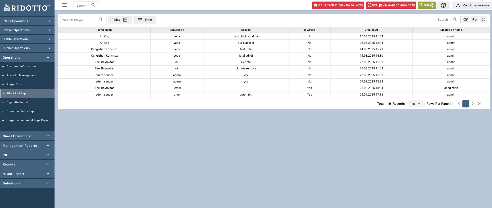

# Black List Report

Black List Report sayfası, oyuncuların blacklist durumlarının yönetimi ve takibi için kullanılan kapsamlı bir raporlama arayüzüdür. Bu sayfa ile blacklist taleplerini görüntüleyebilir, filtreleyebilir ve yönetebilirsiniz.

### Tablo Sütunları

- **Player Name**: Blacklist'e alınan oyuncunun adı ve soyadı
- **Request By**: Blacklist talebini yapan kişi/departman
- **Reason**: Blacklist'e alma sebebi
- **Is Active**: Blacklist durumunun aktif olup olmadığı (Yes/No)
- **Created At**: Blacklist kaydının oluşturulma tarihi ve saati
- **Created By Name**: Kaydı oluşturan kişinin adı

