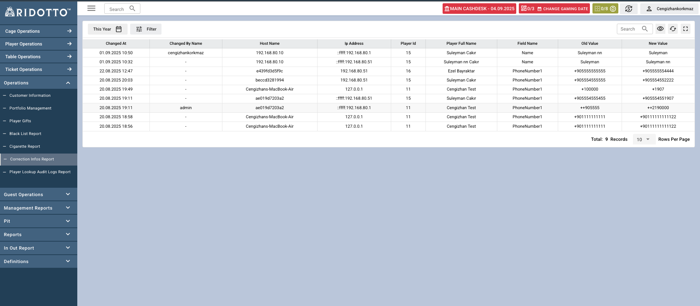

# Correction Infos Report

Correction Infos Report sayfası, oyuncu bilgilerinde yapılan düzeltmelerin ve değişikliklerin takibi için kullanılan kapsamlı bir audit raporlama arayüzüdür. Bu sayfa ile oyuncu bilgilerindeki tüm değişiklikleri görüntüleyebilir ve takip edebilirsiniz.

### Tablo Sütunları

- **Changed At**: Değişikliğin yapıldığı tarih ve saat (DD.MM.YYYY HH:MM formatında)
- **Changed By Name**: Değişikliği yapan kişinin kullanıcı adı
- **Host Name**: İşlemin yapıldığı bilgisayar/host adı
- **Ip Address**: İşlemin yapıldığı IP adresi
- **Player Id**: Değişiklik yapılan oyuncunun sistem ID numarası
- **Player Full Name**: Oyuncunun tam adı ve soyadı
- **Field Name**: Değiştirilen alan adı (Name, PhoneNumber1, vb.)
- **Old Value**: Eski değer (değişiklik öncesi)
- **New Value**: Yeni değer (değişiklik sonrası)

## Değiştirilen Alan Türleri

- **Name** : Oyuncunun adı
- **Surname** :Oyuncunun soyadı
- **Email** : Oyuncunun e-posta adresi
- **PhoneNumber1** : Oyuncunun telefenon numarası
- **PhoneNumber2** : Oyuncunun telefenon numarası
- **PhoneNumber3** : Oyuncunun telefenon numarası
- **Address** : Oyuncunun adres bilgisi
- **Birthdate** : Oyuncunun doğum tarihi
