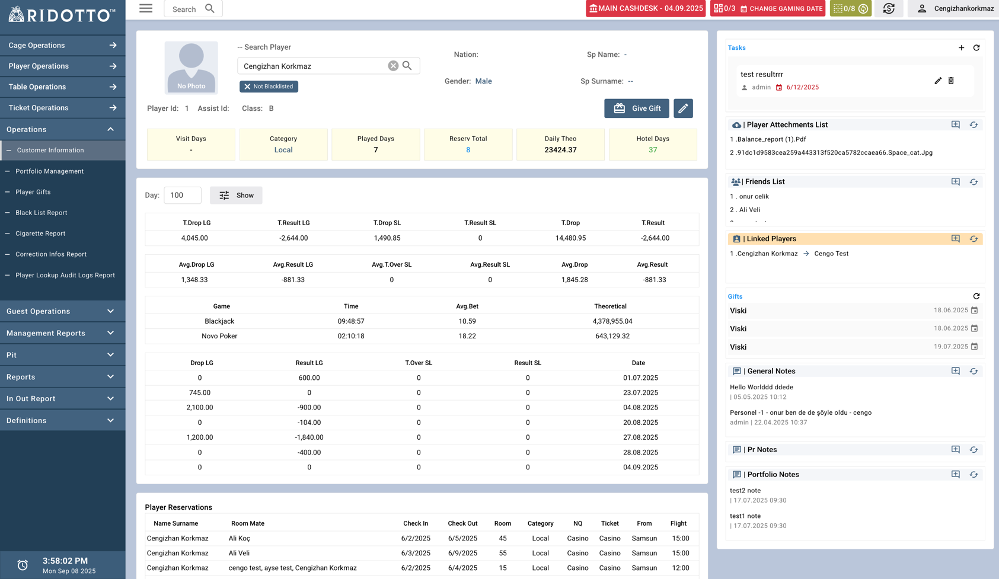

# Customer Information

### Customer Information sayfası, oyuncuların detaylı bilgilerini görüntülemenizi ve çeşitli işlemler yapmanızı sağlayan kapsamlı bir yönetim arayüzüdür.

## Genel Bakış

Bu sayfa, seçili bir oyuncunun tüm bilgilerini tek bir ekranda toplar ve aşağıdaki ana bölümleri içerir:
- Oyuncu temel bilgileri
- Oyun istatistikleri
- Rezervasyon geçmişi
- Yan panel işlemleri

## Oyuncu Arama

### Search Player
- **Arama Kutusu**: Oyuncu adını yazarak arama yapabilirsiniz
- **Temizle Butonu** (×): Arama kutusunu temizlemek için kullanılır
- **Not Blacklisted**: Oyuncunun blacklist olup olmadığını gösterir

### Oyuncu Temel Bilgileri

Arama sonucunda seçilen oyuncunun temel bilgileri görüntülenir:

- **Player Id**: Oyuncu kimlik numarası (örn: 1)
- **Assist Id**: Yardımcı kimlik numarası (örn: 1)  
- **Class**: Oyuncu sınıfı (örn: B)
- **Nation**: Uyruk bilgisi
- **Gender**: Cinsiyet (Male/Female)
- **Sp Name**: Eş adı
- **Sp Surname**: Eş soyadı

## İstatistik Kartları

Sayfanın üst kısmında oyuncunun önemli istatistikleri kart formatında gösterilir:

### Visit Days (Ziyaret Günleri)
- **Açıklama**: Oyuncunun toplam casino ziyaret gün sayısı
- **Hesaplama**: Seçilen tarih aralığında aktivite olan günlerin sayısı

### Category (Kategori)
- **Açıklama**: Oyuncunun sistem kategorisi
- **Kaynak**: `Player kategori` alanından alınır

### Played Days (Oyun Günleri)
- **Açıklama**: Aktif oyun oynanan gün sayısı
- **Hesaplama**: `LgDrop veya  SlotDrop'u  sıfırdan büyükse` koşulunu sağlayan günler

### Resrv Total (Rezervasyon Toplamı)
- **Açıklama**: Seçilen tarih aralığındaki toplam rezervasyon sayısı
- **Hesaplama**: `HotelReservation` tablosundaki kayıt sayısı

### Daily Theo (Günlük Teorik)
- **Açıklama**: Günlük ortalama teorik kazanç
- **Hesaplama**: `Toplam Theoretical / Aktif Oyun Günleri`
- **Kaynak**: Tüm oyunların theoretical değerlerinin toplamı

### Hotel Days (Otel Günleri)
- **Açıklama**: Seçilen tarih aralığındaki toplam otel konaklama günleri
- **Hesaplama**: Tüm rezervasyonlardaki kaldığı gün sayısı

## Oyun İstatistikleri

### Genel İstatistikler
Sayfanın orta kısmında detaylı oyun istatistikleri tablolar halinde sunulur:

#### Ana İstatistik Tablosu (Toplam Değerler)

#### (Day inputundan seçilen gün sayısı : 30 gün ise son 30 günlük data getirir)

**Live Game (LG) Toplamları:**
- **T Drop LG**: Tüm Live Game oyunlarındaki toplam drop miktarı
  - **Hesaplama**: `LgCashDrop + PlaqueDrop` toplamı 

- **T Result LG**: Tüm Live Game oyunlarındaki toplam sonuç
  - **Hesaplama**: Tüm LG oyunlarındaki `Result` değerlerinin toplamı

**Slot Oyunları (SL) Toplamları:**
- **T Drop SL**: Tüm slot oyunlarındaki toplam drop miktarı
  - **Hesaplama**: `SlotDrop` (Bill Acceptor  + Cashdesk işlemleri) toplamı

- **T Result SL**: Tüm slot oyunlarındaki toplam sonuç
  - **Hesaplama**: `(Won - Bet)` değerlerinin toplamı

**Genel Toplamlar:**
- **T Drop**: Tüm oyun türlerindeki toplam drop
  - **Hesaplama**: `Total Drop LG + Total Drop SL`

- **T Result**: Tüm oyun türlerindeki toplam sonuç
  - **Hesaplama**: `Total Result LG + Total Result SL`

#### Ortalama Değerler (Aktif Günlere Göre)

**Live Game Ortalamaları:**
- **Avg Drop LG**: Günlük ortalama LG drop miktarı
  - **Hesaplama**: `Total Drop LG / Aktif LG Gün Sayısı`

- **Avg Result LG**: Günlük ortalama LG sonuç
  - **Hesaplama**: `Total Result LG / Aktif LG Gün Sayısı`

**Slot Oyunları Ortalamaları:**
- **Avg T Over SL**: Günlük ortalama slot turnover
  - **Hesaplama**: `Toplam Slot Turnover / Aktif Slot Gün Sayısı`

- **Avg Result SL**: Günlük ortalama slot sonuç
  - **Hesaplama**: `Total Result SL / Aktif Slot Gün Sayısı` (Slot Drop > 0 olan günler)

**Genel Ortalamalar:**
- **Avg Drop**: Günlük ortalama toplam drop
  - **Hesaplama**: `(Total Drop LG + Total Drop SL) / Aktif Toplam Gün Sayısı`

- **Avg Result**: Günlük ortalama toplam sonuç
  - **Hesaplama**: `(Total Result LG + Total Result SL) / Aktif Toplam Gün Sayısı`

    
### Oyun Detayları

Her oyun türü için detaylı istatistikler gösterilir:

- **Time**: Toplam oyun süresi
  - **Hesaplama**: Toplam oyun süresi `PlayTime` değerlerinin toplamı

- **Avg Bet**: Ağırlıklı ortalama bahis miktarı
  - **Hesaplama**: `Toplam (AvgBet × HandCount) / Toplam HandCount`

- **Theoretical**: Teorik kazanç/kayıp
  - **Hesaplama**: `(PlayTime/60) × AvgBet × HandCount × HouseEdge`

  
> **Not**: Theoretical değeri, oyunun ev avantajı (HouseEdge) oranına göre hesaplanır ve casino açısından beklenen kazancı gösterir.

### Drop ve Result Tablosu

Gaming Date bazında günlük detaylı oyun verileri:

- **Drop LG**: Live Game günlük drop miktarı
  - **Hesaplama**: `LgCashDrop + PlaqueDrop` (o gün için)
  - **Açıklama**: Nakit ve plak işlemlerinin toplamı

- **Result LG**: Live Game günlük sonuç
  - **Hesaplama**: O günkü tüm LG oyunlarındaki `Result` toplamı
  - **Açıklama**: Pozitif değer oyuncu kaybı, negatif değer oyuncu kazancı

- **T Over SL**: Slot oyunları günlük turnover
  - **Hesaplama**: O günkü tüm slot oyunlarındaki `Bet` toplamı
  - **Açıklama**: Toplam bahis miktarı

- **Result SL**: Slot oyunları günlük sonuç
  - **Hesaplama**: `Won - Bet` (o gün için)
  - **Açıklama**: Kazanılan miktar eksi bahis miktarı

- **Date**: Gaming Date adı

## Rezervasyon Geçmişi

### Player Reservations
Seçilen tarih aralığındaki otel rezervasyonları detaylı olarak listelenir:

- **Name Surname**: Rezervasyon sahibinin ad soyad bilgisi
- **Room Mate**: Oda arkadaşları
- **Check In**: Otele giriş tarihi
- **Check Out**: Otelden çıkış tarihi
- **Room**: Oda numarası
- **Category**: Oyuncu kategorisi
- **Ticket**: Bileti alan taraf
- **From**: Nereden geldiği bilgisi
- **Flight**: Uçuş bilgileri

## Yan Panel İşlemleri

Sayfanın sağ tarafında bulunan yan panel çeşitli işlem seçenekleri sunar:

### Tasks (Görevler)
- **Add Task**: Yeni görev ekleme 
- **Task List**: Mevcut görevlerin listesi

### Player Attachments List (Oyuncu Ekleri)
- **Add Attachment**: Yeni ek dosya yükleme
- **Attachment List**: Mevcut ek dosyaların listesi

### Friends List (Arkadaş Listesi)
- **Add Friend**: Yeni arkadaş ekleme
- **Friend List**: Mevcut arkadaşların listesi

### Linked Players (Bağlantılı Oyuncular)
- **Add Linked Player**: Yeni bağlantılı oyuncu ekleme
- **Linked Player List**: Mevcut bağlantılı oyuncuların listesi

### Gifts (Hediyeler)
Hediye geçmişi:
- **Gift List**: Oyuncuya verilen hediyelerin listesi

### Notes (Notlar)

#### General Notes (Genel Notlar)
- **Add General Note**: Yeni genel not ekleme
- **General Note List**: Mevcut genel notların listesi

#### Pr Notes (PR Notları)
- **Add Pr Note**: Yeni Pr not ekleme
- **Pr Note List**: Mevcut Pr notların listesi

#### Portfolio Notes (Portfölyo Notları)
- **Add Portfolio Note**: Yeni portfölyo not ekleme
- **Portfolio Note List**: Mevcut portfölyo notların listesi
