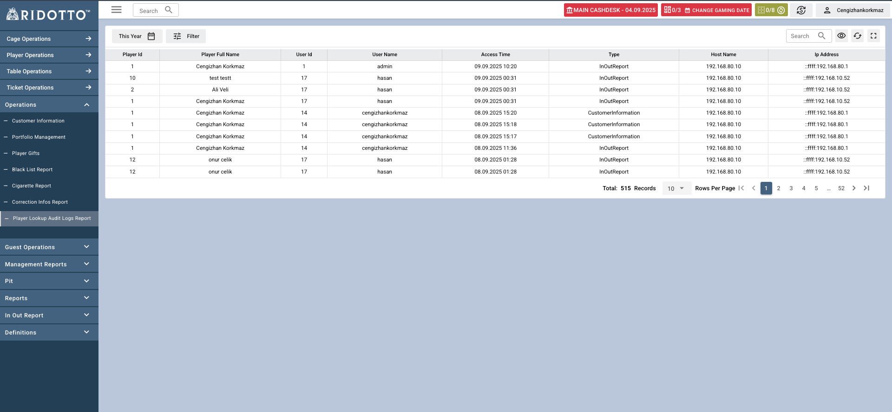

Player Lookup Audit Logs Report sayfası, oyuncu arama ve sorgulama aktivitelerinin takibi için kullanılan kapsamlı bir audit raporlama arayüzüdür. Bu sayfa ile sistem kullanıcılarının oyuncu bilgilerine erişim aktivitelerini görüntüleyebilir ve takip edebilirsiniz.

## Tablo Sütunları

- **Player Id**: Aranan oyuncunun sistem ID numarası
- **Player Full Name**: Oyuncunun tam adı ve soyadı
- **User Id**: Aramayı yapan kullanıcının sistem ID'si
- **User Name**: Aramayı yapan kullanıcının kullanıcı adı
- **Access Time**: Erişim tarihi ve saati (DD.MM.YYYY HH:MM formatında)
- **Type**: Erişim yaptığı sayfa (InOutReport, CustomerInformation)
- **Host Name**: İşlemin yapıldığı bilgisayar/host adı
- **Ip Address**: İşlemin yapıldığı IP adresi

