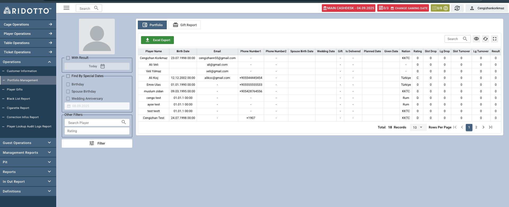

# Portfolio Management

Portfolio Management sayfası, oyuncunun rating ve oyun result değerlerine göre kapsamlı bir arayüz sunar. Bu sayfa ile oyuncuları çeşitli kriterlere göre filtreleyebilir Excel formatında dışa aktarabilirsiniz.

## Üst Panel İşlemleri

### Portfolio Butonu
- **İşlev**: Portföy raporunu görüntülemek için kullanılır
- **Açıklama**: Seçili filtrelere göre oyuncuları listeler

### Gift Report Butonu
- **İşlev**: Hediye raporlarını görüntülemek için kullanılır
- **Açıklama**: Oyunculara verilen hediyelerin detaylı raporunu sunar

### Excel Export Butonu
- **İşlev**: Filtrelenmiş veriyi Excel formatında dışa aktarır

## Filtreleme Sistemi

### Temel Filtreler

#### With Result
- **İşlev**: Seçilen tarih aralığında oyun result bilgisini de hesaplar.

#### Find By Special Dates (Özel Tarih Filtreleri)
Oyuncuları özel günlerine göre filtreleme seçenekleri:

##### Birthday (Doğum Günü)
- **İşlev**: Doğum günü olan oyuncuları filtreler

##### Spouse Birthday (Eş Doğum Günü)
- **İşlev**: Eşinin doğum günü olan oyuncuları filtreler

##### Wedding Anniversary (Evlilik Yıldönümü)
- **İşlev**: Evlilik yıldönümü olan oyuncuları filtreler

### Tarih Seçimi
- **İşlev**: Belirli bir tarih aralığını seçmenizi sağlar

### Diğer Filtreler

#### Search Player
- **İşlev**: Oyuncu adına göre arama yapar

#### Rating Filtresi
- **İşlev**: Oyuncu rating'ine göre filtreleme

## Oyuncu Listesi Tablosu

- **Player Name (Oyuncu Adı)**: Ad ve soyad bilgisi
- **Birth Date (Doğum Tarihi)**: Oyuncunun doğum tarihi
- **Email**: E-posta adresi
- **Phone Number1 (Telefon 1)**: Birincil telefon numarası 
- **Phone Number2 (Telefon 2)**: İkincil telefon numarası
- **Spouse Birth Date (Eş Doğum Tarihi)**: Eşin doğum tarihi, boş ise "-"
- **Wedding Date (Evlilik Tarihi)**: Evlilik tarihi, boş ise "-"
- **Gift (Hediye)**: Hediye durumu (Var/Yok)
- **Is Delivered (Teslim Edildi Mi)**: Hediye teslim durumu (Evet/Hayır)
- **Planned Date (Planlanan Tarih)**: Hediye teslim planı
- **Given Date (Verilme Tarihi)**: Hedivenin verilme tarihi
- **Nation (Uyruk)**: Oyuncunun uyruğu (KKTC, Türkiye, Rum)
- **Rating (Değerlendirme)**: Oyuncu rating sınıfı (A, B, C, D)
- **Slot Drop**: Slot oyunlarındaki toplam drop miktarı
- **Lg Drop (Live Game Drop)**: Live game oyunlarındaki toplam drop miktarı
- **Slot Turnover**: Slot oyunlarındaki toplam bahis miktarı
- **Lg Turnover**: Live game oyunlarındaki toplam bahis miktarı
