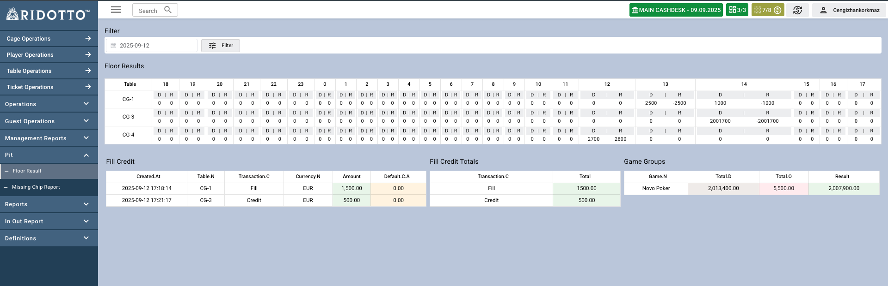

## Genel Bakış

Bu sayfa, belirli bir tarih için tüm masa durumlarını saatlik olarak drop ve result bilgisi gösterilir, fill/credit işlemlerini ve oyun gruplarına göre toplu sonuçları gösterilir.

## Sayfa Bölümleri

### Tarih Filtresi
- **Tarih Seçimi**: Raporlanacak tarihi seçmek için kullanılır
- **Filter Butonu**: Seçilen tarihe göre verileri filtreler

### Floor Results Tablosu

#### Masa Durumu Gösterimi
Her masa için saat bazında durumu gösterilir (24 saat):

- **Table**: Masa numarası (CG-1, CG-3, CG-4 gibi)
- **Saat Kolonları**: Her saat için masa durumu
  - **D**: Drop (cash + plaque)
  - **R**: Result (sonuç)

#### Fill Credit Detayları
Masa bazında fill ve credit işlemlerini gösterir:

- **Created At**: İşlem oluşturulma tarihi ve saati
- **Table N**: Masa numarası
- **Transaction C**: İşlem tipi (Fill/Credit)
- **Currency N**: Para birimi
- **Amount**: İşlem miktarı
- **Default C A**: Varsayılan currency amount 
- **Transaction C**: İşlem kodu( Fill/Credit)
- **Total**: İşlem toplamı

### Fill Credit Totals

Günlük toplam fill ve credit işlemlerini transaction code'a göre gösterir.
- **Transaction C**: İşlem Kodu( Fill/Credit)
- **Total**: Toplam miktar

### Game Groups

Oyun gruplarına göre toplu sonuçlar:
- **Game N**: Oyun adı (örn: Novo Poker)
- **Total D**: Toplam drop miktarı
- **Total O**: Diğer işlemler toplamı
- **Result**: Net sonuç

